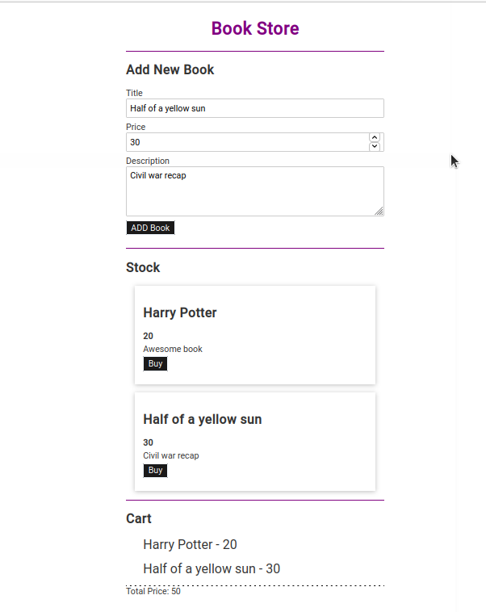

# Svelte Bookstore

This is a example [Svelte](https://svelte.dev/) app.



To run the app, run the following commands:

```bash
npm install
npm run dev
```

*Note that you will need to have [Node.js](https://nodejs.org) installed.*
